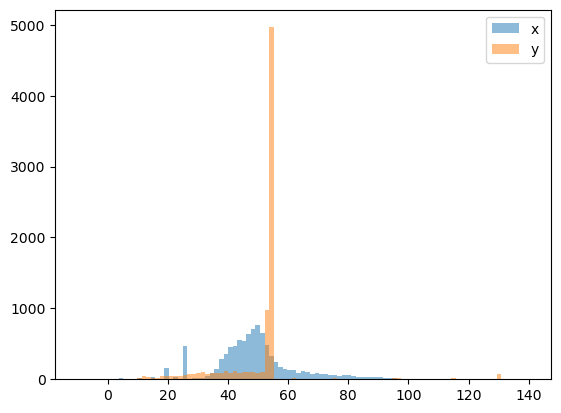

```{r setup, include=FALSE}
knitr::opts_chunk$set(echo = TRUE)
library(Matrix)
library(psych)
library(hash)
library(MASS)

library(stringr)
library(optimx)
library(leaps)
```

\section*{Abstract}

I explore regression, both multiple and nonlinear, on variable length finite state sequences. I explore these models with the goal of understanding how certain protein sequences imply their thermostability.  This work also suggests the need for short term memory within any model architecture should anyone wish to accurately predict the thermostability of a sequence. 


\section*{Introduction}


The company Novozymes has released a Kaggle competition asking competitors to be able to predict enzyme thermostability. This work is valuable because the thermal stability of protein determines how much they can perform under harsh application conditions and/or their efficiency in serving as catalysts. This work is so valuable in fact that the top 3 scores win a cash prize, first place consisting of $12,000! The dataset itself only consists of the following varaibles: 

\begin{itemize}
\item \textbf{Protein Sequence: } A variable length sequence of 20 possible states. An example sequence: 
\begin{verbatim}
VPVNPEPDATSVENVALKTGSGDSQSDPIKADLEVKGQSALPFDVDCWAILCKGAPNVLQRVNEKTKNSNRDRSGANKGPFKDPQKWGIKALPPKNPSWSAQDFKSPEEYAFASSLQGGTNAILAPVNLASQNSQGGVLNGFYSANKVAQFDPSKPQQTKGTWFQITKFTGAAGPYCKALGSNDKSVCDKNKNIAGDWGFDPAKWAYQYDEKNNKFNYVGK
\end{verbatim}
Sequences can range from 200 to 30,000 states, which is why traditional models fail for this dataset. We need to be able to intake an adjustable amount of input. 
\item \textbf{pH: } The acidity level at which these sequences thermostability were measured. \textbf{Note:} There are some values in the dataset that exceed 14. These could be errors on the part of the recorder. 
\item \textbf{tm: } The measured thermostability. \text{Response Variable.}
\end{itemize}

The number of given points in this dataset is 313901 There is also an competition set with 2413 sequences. 


```{r open_dataset, echo = FALSE}
training_data <- read.csv(file = 'train.csv')
keeps <- c("protein_sequence", "pH","tm")
training_data <- training_data[keeps]

update_training_data <- read.csv(file = 'train_updates_20220929.csv')
for (row in 1:nrow(update_training_data)) {
  if(update_training_data[row, "protein_sequence"] != "") {
    training_data[row, "protein_sequence"] <- update_training_data[row, "protein_sequence"]
    training_data[row, "pH"] <- update_training_data[row, "pH"]
    training_data[row, "tm"] <- update_training_data[row, "tm"]
  }
}

#sapply(training_data,class)

```


```{r dataset_length, echo = FALSE}
#print(nrow(training_data))
N <- nrow(training_data)
testing_data <- read.csv(file = 'test.csv')
#print(nrow(testing_data))
M <- nrow(testing_data)
training_data$pH[is.na(training_data$pH)] <- 7
```

So for this project, I will be trying to do the following: 

\begin{enumerate}
\item Develop a model that will map a variable length sequence to a regressed value. 
\item Approach whether or not a language model (with the concept of memory) is necessary.
\item Indicate connections that suggest stable or unstable protein sequences. 
\end{enumerate}


\section*{Methods and Results}

\subsection*{Initial Data Exploration} 

For each of the given variables, we plot the histograms of frequency in the appendix. Specifically, the response variable we are trying to predict is highly clumped and centered around 48 degrees. It's likeliy this suggests a nonlinearity within our dataset. Therefore, we should avoid just jumping into a multiple linear regression. Instead, we turn towards to different models to try and capture this nonlinearity. 

\subsection*{First Model} 

Given an enzyme sequence $(\{s_i\}_{i = 1}^n, pH)$ pair, we consider important multivariable functions, similar to those we study in this class: 

\begin{enumerate}
\item The \textbf{Predictive Value}, which should represent how much we trust an individual character sequence: 

$$\text{predictive value}(s_i, pH) \sim \alpha_0 + \frac{\alpha_1}{\text{prevalence}(s_i)} + \frac{\alpha_2}{\text{variance}(s_i)} + \frac{\alpha_3}{1 + |pH - \text{median}\{pH(s_i)\}|} $$
\item The \textbf{Expected Value}, which represents what thermostability that sequence will likely take on based off that subset alone: 
$$\text{expected value}(s_i) \sim \beta_0 + \beta_1 \text{mean}(s_i) + \beta_2 \max(s_i) + \beta_3 \min(s_i) + \beta_4 \text{median}(s_i) + \beta_5\text{lower quartile}(s_i) +\beta_6\text{upper quartile}(s_i) $$
\end{enumerate}

We then construct a predictor model to be: 


$$Y_{pred}(\{s_i \}_{i = 1}^n , pH)  = \frac{\sum_{i = 1}^n \text{predictive value}(s_i, pH) \cdot \text{expected value}(s_i)}{\sum_{i = 1}^n \text{predictive value}(s_i, pH)}$$

Our predictor function is nonlinear and therefore we turn to optimization to find our coefficient estimators. We define the loss function be 

$$\mathcal{L}(Y_{pred}, Y_{true}) = \frac{1}{N} \sum_{k = 1}^N (Y_{pred}^{(k)} - Y_{true}^{(k)})^2$$
where $N < 31390.$ We can then optimize by minimizing this loss function over the few linear coefficients chosen above in order to minimize loss. 

\subsection*{First Model Performance} 

Upon minimizing the mean square error over all of our labelled data, we obtained a MSE of 168 on train and 211 on our validation set. Submitting the competition dataset gives a Spearman correlation of 0.13. The current leading model has a score of 0.8, placing me at a rank of 1111 out of 1845 submitted models. From the figure labelled nonlinear model diagnostics, we see that our model lacks expressibility, specifically because of the large concentration of values that surround the mean of thermostability. This indicates that we are inferring on too few features. So instead we need to turn towards a more verbose model in order to solve this problem. 

The difficulty with nonlinear models is interpreting the coefficients. So instead we shall turn to a more linear approach in order to gain a better understanding of the role these n-grams play. 

\subsection*{Second Multilinear Model} 

We enumerate every 2-gram composed by any two states within the 20 possible achievable states for our sequences. We make the assumption that this model is NOT language in nature and therefore do not have a need for long term memory. We construct indicator functions of the following form: 

$$\chi_{B}(\{s_i\}_{i = 1}^n) = \begin{cases}
1 & \text{ if } B \in \{s_i\}_{i = 1}^n \\
0 & \text{otherwise}
\end{cases}$$

We then transform the dataset of tuples 

$$(\{s_i\}_{i = 1}^n, pH, tm) \rightarrow (pH, \underbrace{\chi_{jk}(\{s_{i}\}_{i =1}^n )}_{400 \text{ features}}, tm)$$

Therefore, we have a model with 401 linear feature variables. This makes it very difficult to capture interactions because that would lead to $401^2 = 160801$ feature variables to consider. The only feature we can reasonably interact with is the ph level. Therefore, we are left considering the model: 

$$f(tm) = \beta_0 + \beta_1 pH + \sum_{j = 1}^{20} \sum_{k = 1}^{20} \beta_{jk} \chi_{jk}(\{s_{i}\}_{i =1}^n) + pH \sum_{j = 1}^{20} \sum_{k = 1}^{20} \beta_{jk}' \chi_{jk}(\{s_{i}\}_{i =1}^n) $$
we allow $f$ to be the function derived from the box-cox procedure. Specifically, we find a good value for lambda to be: 

$$\lambda = 0.5858586$$

which transforms our dataset and (hopefully) allows us to capture any nonlinearities. Therefore, we get for our model 

$$\frac{1}{\lambda} \left ( (tm + shift)^{\lambda} - 1 \right) = \beta_0 + \beta_1 pH + \sum_{j = 1}^{20} \sum_{k = 1}^{20} \beta_{jk} \chi_{jk}(\{s_{i}\}_{i =1}^n) + pH \sum_{j = 1}^{20} \sum_{k = 1}^{20} \beta_{jk}' \chi_{jk}(\{s_{i}\}_{i =1}^n)$$

\textbf{Note:} There is no possible way to explicitly write out this function. There are far too many feature variables. Please see the appendix for the model summary. 

\subsection*{Linear Categorical Model Performance} 

We get an MSE of about 4.49 with an $$R^2_a \approx 0.42,$$ which is relatively good for a model of this size. Taking a look at the residuals versus fitted values, nothing suggests nonlinearity, as well as a pretty well behaved Q-Q plot, with the except of a couple of outliers. 

We turn to the validation set to provide more contest. We see that the 

$$MSPE_{v} = 4.97326 < 4.006 \approx \frac{SSE}{N}$$
which suggests that there is no severe overfitting of our model and that it is potentially generalizable. We also see that the $$R_a^2 \approx 0.50$$, higher than that of the trained model! If we were to look at the estimated coefficients, we would see much of them are the same between the training model and the validation model, with the exceptions left for less significant estimators. 

Lastly, we can look at the overlay of the predicted values on the validation set versus the true values. We see that compared to the previous nonlinear model, these distributions appear more similar in shape and value coverage. This suggests that the model does reasonably have the ability to achieve the expected values for thermostability. 

\section*{Valuable Questions}

\begin{itemize}
\item \textbf{How much of this data is explainable at this level?} Compared to other competitors using large scale language models like BERT, both models considered are incredibly tiny. But the current top place model is large BERT model with a Spearman coefficient score of 0.8, while this model yields a max score of 0.137. It's likely that this dataset does necessitate the concept of memory in order to predict values accurately. 


\item \textbf{Are some chain subsets more important than others?} Creating a model in this way, similar to those we have made all quarter long, allows us to analyze our coefficients and draw conclusions about the data our models describe. Observe, from the table listed under \textbf{Linear Categorical Model}, we can target very specific problematic sequence connections, such as 'NQ' and 'LC'. These coefficients also suggest potential replacements, such as 'YM' or 'MH'. We can tell from the summary table that these are very signifcant variables, with a p-value of being zero less than a significance level of 0.001. However, upon multiple choices of a random seed, these variables are subject to shift for different train / validation sets. Therefore, one should consider range of top coefficients as good and a range of bottom coefficients as bad instead of focusing specifically on the bottom or topmost coefficients. 

Also looking at these coefficients, we can see less useful interactions between pH and these connections make up the coefficients closest to zero. Checking their significance, they all fail to reject the hypothesis that their coefficients are anything but zero. HOWEVER, modelling without these interactions results in higher MSE. So for the moment, it is best to leave these variables within the model. 

\end{itemize}


\section*{Conclusions and Limitations}

Multple regression models are able to provide a humanly interpretable way of understanding data, especially data as complicated as variable length sequence, such as DNA, Proteins, etc. Specifically, a categorical regression model is able to achieve a decent score in order to estimate this dataset. However, it's likely there are more nonlinearities at foot. OR, there are significant interactions that cannot be captured due to R's inability to handle large feature sets. These limitations mean only so many models can be approached. 

With those limitations in mind, I was able to develop a reasonable model with good performance on a validation set, as well as some generalizability on the competition test set. We also see that the coefficients of this model are helpful for drawing conclusions on the amino acid connections of Novozymes. 

\subsection*{Appendix 1: Figures and Tables}

\subsubsection*{Data Exploration}


```{r data_exploration, echo = FALSE}

print_hist <- function(x, title, scale) {

  x2 <- seq(min(x), max(x), length = 40)

  fun <- dnorm(x2, mean = mean(x), sd = sd(x))
  
  hist(x, prob = TRUE, ylim = c(0, scale), col = "white", main=title)
  lines(density(x), col = 4, lwd = 2)
}

par(mfrow = c(2, 2))

print("tm quartiles:")
quantile(training_data$tm)

print("pH quartiles:")
quantile(training_data$pH)

print("Protein Sequence Length quartiles:")
quantile(nchar(training_data$protein_sequence))

print_hist(training_data$tm, 'Histogram of Thermostability',0.06)

print_hist(training_data$pH, 'Histogram of pH Level',0.3)

print_hist(nchar(training_data$protein_sequence), 'Histogram of Protein Length',0.0025)


# lambda <- bc$x[which.max(bc$y)]
# print(lambda)
# 
# K_2 <- prod(Y)^(1/length(Y))
# K_1 <- 1/(K_2^(lambda - 1))
# print(K_1)
# 
# Y_transform <- K_1/lambda * (Y^lambda - 1)
# inverse_transform <- function(z) {
#   return((lambda*z / K_1 + 1)^(1/lambda))
# }
```

\subsubsection*{Nonlinear Model Diagnostics}

```{r}

```

\subsubsection*{Linear Categorical Model} 


```{r featurization_3, echo = FALSE}

phrase_2_col_dictionary <- hash()

states <- c('A','C','D','E','F','G','H','I','K','L','M','N','P','Q','R','S','T','V','W','Y')
col_names <- rep("", 402)
#col_names <- rep("", 8002)
col_names[1] <- "pH"

col = 2
for (i in states) {
  for ( j in states ) {
    #for (k in states) {
      #phrase_2_col_dictionary[[paste(i,j,k,sep='')]] = col
      #col_names[col] <- paste(i,j,k,sep='')
      phrase_2_col_dictionary[[paste(i,j,sep='')]] = col
      col_names[col] <- paste(i,j,sep='')
      col <- col + 1
    #}
  }
}

col_names[402] <- "tm"
# 
# training_data_wide <- data.frame(matrix(ncol = 402, nrow = 0))
# 
# # col_names[8002] <- "tm"
# # 
# # training_data_wide <- data.frame(matrix(ncol = 8002, nrow = 0))
# colnames(training_data_wide) <-col_names
# 
# for (row in 1:N) {
#   curr_sequence <- training_data[row, "protein_sequence"]
#   #training_data_wide[row,] <- rep(0, 8002)
#   training_data_wide[row,] <- rep(0, 402)
#   training_data_wide[row,"pH"] <- training_data[row, "pH"] 
#   training_data_wide[row,"tm"] <- training_data[row, "tm"] 
#   
#   #for (k in 1:(nchar(curr_sequence)-2)) {
#   #  curr_substr <- substr(curr_sequence, k, k+2)
#   for (k in 1:(nchar(curr_sequence)-1)) {
#     curr_substr <- substr(curr_sequence, k, k+1)
#     
#     training_data_wide[row,col_names[phrase_2_col_dictionary[[curr_substr]]]] <- training_data_wide[row,col_names[phrase_2_col_dictionary[[curr_substr]]]] + 1
#     
#   }
# }
# 
# write.csv(training_data_wide, "training_data_wide.csv", row.names=FALSE)

training_data_wide <- read.csv(file = 'training_data_wide_ones.csv')
#training_data_wide = subset(training_data_wide, select = -c(X) )
#names(training_data_wide)[names(training_data_wide) == 'NA.'] <- 'NA'

# reduced_df <- training_data_wide[ , -which(names(training_data_wide) %in% c("pH","tm"))]
# reduced_df[-1] <- as.numeric(reduced_df[-1] != 0)
# reduced_df$pH <- training_data_wide$pH
# reduced_df$tm <- training_data_wide$tm
# 
# training_data_wide <- reduced_df
# 
# write.csv(training_data_wide, "training_data_wide_ones.csv", row.names=FALSE)

shift <- 0.01 - min(training_data_wide$tm) 
bc <- boxcox(tm + shift ~ . + pH:., data=training_data_wide)

lambda <- bc$x[which.max(bc$y)]
print('lambda')
print(lambda)

K_2 <- 1
K_1 <- 1

Y_transform <- function(z) {
  return(K_1/lambda * ((z)^lambda - 1)  + shift)
} 

inverse_transform <- function(z) {
  return((lambda*(z - shift) / K_1 + 1)^(1/lambda))
}

#write.csv(training_data_wide, "training_data_wide_ones.csv", row.names=FALSE)

#training_data_wide$sequence_lengths <- nchar(training_data$protein_sequence)

#sapply(training_data_wide,class)
```


```{r modeling, echo = FALSE}
set.seed(402) 
ind <- sample(1:N, 0.9*N, replace=FALSE)

train <- training_data_wide[ind, ] #training set
valid <- training_data_wide[-ind, ] #validation/test set

train1 <- lm(Y_transform(tm) ~ . + pH:., data = train)
valid1 <- lm(Y_transform(tm) ~ . + pH:., data = valid)

model_coefs <- sort(train1$coefficients)

print('Maximum Coefficients')
print(model_coefs[length(model_coefs) - (4:0)])

print('Minimum Coefficients')
print(model_coefs[1:5])

model_coefs <- sort(abs(train1$coefficients))

print('Least Impactful Coefficients')
print(model_coefs[1:5])

```


\subsubsection*{Linear Categorical Model Diagnostics}


```{r model_diagnostics, echo = FALSE}
par(mfrow = c(2, 2))


plot(train1,which=1) ##residuals vs. fitted values

# train_betas <- coef(summary(train1))[,1]
# valid_beta <- coef(summary(valid1))[,1]
# deltas <- abs(train_betas - valid_beta)

plot(train1,which=2) ##residuals Q-Q plot

# mod_sum <- cbind(coef(summary(train1))[,1], coef(summary(valid1))[,1],
#   coef(summary(train1))[,2], coef(summary(valid1))[,2],deltas)
# colnames(mod_sum) <- c("Train Est","Valid Est","Train s.e.","Valid s.e.","Normed Delta in Coefficients")

boxplot(train1$residuals) ## residuals boxplot


sse_t <- sum(train1$residuals^2)
sse_v <- sum(valid1$residuals^2)
Radj_t <- summary(train1)$adj.r.squared
Radj_v <- summary(valid1)$adj.r.squared
train_sum <- c(sse_t,Radj_t)
valid_sum <- c(sse_v,Radj_v)
criteria <- rbind(train_sum,valid_sum)
colnames(criteria) <- c("SSE","R2_adj")
print(criteria)


#Get MSPE_v from new data
#newdata <- valid[, -1]
y.hat <- predict(train1, valid)
MSPE <- mean((Y_transform(valid$tm) - y.hat)^2)

print('MSPE')
print(MSPE)

print('SSE / N')
print(sse_t/N)
# 
# 
hist(y.hat, prob = TRUE, ylim = c(0, 0.36), xlab="mean tm contribution", main="Predicted versus True Distributions")
lines(density(y.hat), col = 4, lwd = 2)
hist(Y_transform(valid$tm), prob = TRUE, add=TRUE)
lines(density(Y_transform(valid$tm)), col = 2, lwd = 2)


```

\subsubsection*{Model Summary}

```{r submission, echo = FALSE}
summary(train1)
anova(train1)

# testing_data_wide <- data.frame(matrix(ncol = 401, nrow = 0))
# colnames(testing_data_wide) <-col_names[-length(col_names)]
# 
# for (row in 1:M) {
#   curr_sequence <- testing_data[row, "protein_sequence"]
#   testing_data_wide[row,] <- rep(0, 401)
#   testing_data_wide[row,"pH"] <- testing_data[row, "pH"]
# 
#   for (k in 1:(nchar(curr_sequence)-1)) {
#     curr_substr <- substr(curr_sequence, k, k+1)
# 
#     testing_data_wide[row,col_names[phrase_2_col_dictionary[[curr_substr]]]] <- 1
#   }
# }
# 
#  write.csv(testing_data_wide, "testing_data_wide.csv", row.names=FALSE)

testing_data_wide <- read.csv("testing_data_wide.csv")

```


```{r submission_2, echo = FALSE}
predictions <- predict(train1, testing_data_wide)
pred_Y <- inverse_transform(predictions)
```


```{r submission_3, echo = FALSE}
submission_df <- data.frame(matrix(ncol = 2, nrow = 0))
colnames(submission_df) <-c("seq_id", "tm")

for (row in 1:M) {
    submission_df[nrow(submission_df) + 1,] <- c(testing_data[row, "seq_id"], pred_Y[row])
}

write.csv(submission_df,"submission.csv", row.names = FALSE)
```


\subsection*{Appendix2: All code for this report}

```{r ref.label=knitr::all_labels(), echo=TRUE, eval=FALSE}
# Nonlinear Model Python Code

import pandas as pd
from collections import defaultdict
from biopandas.pdb import PandasPdb
import numpy as np
import matplotlib.pyplot as plt
import seaborn as sns
import gc
import warnings
import datetime as dt
import math
from random import sample

np.random.seed(0)
warnings.simplefilter("ignore")
import statistics as stats

from sklearn.model_selection import train_test_split

from statistics import median
from collections import Counter

from sklearn.ensemble import RandomForestRegressor
from sklearn import metrics

from sklearn.tree import export_graphviz
from sklearn.tree import plot_tree
import graphviz

# # Reading Data Files

train = pd.read_csv("train.csv")
test = pd.read_csv("test.csv")
sub = pd.read_csv("sample_submission.csv")

display(train.head())
display(test.head())
display(sub.head())

# update to training data
update = pd.read_csv("train_updates_20220929.csv")
for index, row in update.iterrows():
    if not pd.isnull(row['protein_sequence']):
        train.loc[index,'seq_id'] = update.loc[index,'seq_id']
        train.loc[index,'protein_sequence'] = update.loc[index,'protein_sequence']
        train.loc[index,'pH'] = update.loc[index,'pH']
        train.loc[index,'data_source'] = update.loc[index,'data_source']
        train.loc[index,'tm'] = update.loc[index,'tm']
        
# data imputation 
for index, row in train.iterrows():
    if pd.isnull(row['pH']):
        train.loc[index,'pH'] = 7

protein_sequence_len = []

for sequence in train['protein_sequence'].to_list():
    protein_sequence_len.append(len(sequence))

print("train shape:", train.shape)
print("test shape:", test.shape)
print("sub shape:", sub.shape)

print("train nan value sum:", train.isna().sum().sum())
print("test nan value sum:", test.isna().sum().sum())

train.isna().sum()

Xy = train.to_numpy()

X_train = Xy[:,:-1]
y_train = Xy[:,-1]


# # Analyze 3-gram distributions

n_gram = []
seq_id = []
ph_level = []
origin_freq = []
expected_tm = []

prevalence = defaultdict(int)
typical_ph_levels = defaultdict(list)


for curr_val, my_tm in zip(X_train, y_train):
    my_id = curr_val[0]
    my_sequence = curr_val[1]
    my_ph = curr_val[2]
    
    for k in range(len(my_sequence) - 2):
        my_substring = my_sequence[k:k+3]
        n_gram.append(my_substring)
        seq_id.append(my_id)
        ph_level.append(my_ph)
        origin_freq.append(my_sequence.count(my_substring))
        prevalence[my_substring] += 1
        typical_ph_levels[my_substring].append(my_ph)
        expected_tm.append(my_tm)

states = ['A','C','D','E','F','G','H','I','K','L','M','N','P','Q','R','S','T','V','W','Y']

phrase_2_col_dictionary = {}

substring_length = 3
vector_length = len(states)**substring_length + 2

col_names = []
col_names.append("pH")

col = 1
for i in states:
    for j in states:
        for k in states:
            curr_phrase = "".join([i,j,k])
            phrase_2_col_dictionary[curr_phrase] = col
            col_names.append(curr_phrase)
            col = col + 1
        
col_names.append("tm")


training_data_wide = pd.DataFrame(columns = col_names)

count = 0
for curr_val, my_tm in zip(X_train, y_train):
    my_id = curr_val[0]
    my_sequence = curr_val[1]
    my_ph = curr_val[2]
    
    new_vec = [0 for _ in range(vector_length)]
    new_vec[0] = my_ph
    new_vec[vector_length-1] = my_tm
    
    for k in range(len(my_sequence) - substring_length + 1):
        my_substring = my_sequence[k:k+substring_length]
        new_vec[phrase_2_col_dictionary[my_substring]] += 1
        
    res = {col_names[i]: new_vec[i] for i in range(len(new_vec))}
    training_data_wide = training_data_wide.append(res, ignore_index = True)
    
    count += 1
    
    if count % 100 == 0:
        print(count)

training_data_wide.to_csv('3_gram_factorization.csv')


sequence_vals = defaultdict(list)
average_ph_levels = defaultdict(float)

for phrase, tm in zip(n_gram, expected_tm):
    sequence_vals[phrase].append(tm)
    
for key, val in typical_ph_levels.items():
    average_ph_levels[key] = stats.mean(val)

sequence_mean = defaultdict(float)
sequence_median = defaultdict(float)
sequence_std = defaultdict(float)
sequence_max = defaultdict(float)
sequence_min = defaultdict(float)
sequence_statmax = defaultdict(float)
sequence_statmin = defaultdict(float)
median_ph = defaultdict(float)
sequence_prevalance = defaultdict(int)

for phrase, vals in sequence_vals.items():
    sequence_prevalance[phrase] = len(vals)
    sequence_mean[phrase] = stats.mean(vals)
    sequence_median[phrase] = stats.median(vals)
    sequence_std[phrase] = stats.stdev(vals)
    sequence_max[phrase] = max(vals)
    sequence_min[phrase] = min(vals)
    sequence_statmax[phrase] = sequence_mean[phrase] + sequence_std[phrase] 
    sequence_statmin[phrase] = sequence_mean[phrase] - sequence_std[phrase] 
    median_ph[phrase] = stats.median(typical_ph_levels[phrase])


df = pd.DataFrame([(phrase, sequence_prevalance[phrase], sequence_std[phrase], median_ph[phrase], sequence_mean[phrase], sequence_max[phrase], sequence_min[phrase], sequence_median[phrase], sequence_statmin[phrase], sequence_statmax[phrase]) for phrase in sequence_mean.keys()], 
                   columns=['subsequence', 'prev', 'std','median_ph','mean_tm','max_tm','min_tm','median_tm','lower_quartile_tm','upper_quartile_tm'])

df.to_csv('phrase_stats.csv')


# # Train - Test Split

X_train, X_val, y_train, y_val = train_test_split(Xy[:,:-1], Xy[:,-1], test_size=0.30, random_state=42)

# # Model Definition

def sigmoid(z):
    if z > 10:
        return 0
    return 1/(1 + math.exp(z))

def predictive_value(alpha,s_i, curr_ph):
    if sequence_prevalance[s_i] == 0:
        return 0
    return sigmoid(alpha*(sequence_prevalance[s_i])*(1 + sequence_std[s_i])*math.exp(abs(curr_ph - median_ph[s_i])))

def expected_value(beta,s_i):
    return_val = beta[0] 
    return_val += beta[1]*sequence_mean[s_i] 
    return_val += beta[2]*sequence_max[s_i] 
    return_val += beta[3]*sequence_min[s_i] 
    return_val += beta[4]*sequence_median[s_i] 
    return_val += beta[5]*sequence_statmin[s_i] 
    return_val += beta[6]*sequence_statmax[s_i] 
    
    return return_val


def predictor(param_vec, curr_sequence, curr_ph):
    num_val = 0
    den_val = 0
    
    for k in range(len(curr_sequence) - 2):
        s_k = my_sequence[k:k+3]
        pred_val = predictive_value(param_vec[0:4], s_k, curr_ph)
        exp_val = expected_value(param_vec[4:12],s_k)
        num_val += pred_val*exp_val
        den_val += pred_val
        
        num_val += exp_val
        den_val += pred_val
        
    if den_val == 0:
        return 0
    else:
        return num_val / len(curr_sequence)

predictor([1,1,1,1,1,1,1,1,1,1,1], X_train[0][1], X_train[0][2])

def Loss(param_vec):
    
    print('Call to Loss')
    
    batch_size = 1000
    
    sampled_list = sample(range(len(X_train)), batch_size)
    
    my_sum = 0
    count = 0
    
    for k in sampled_list: 
        curr_ph = X_train[k][2]
        curr_sequence = X_train[k][1]
        Y_pred = predictor(param_vec, curr_sequence, curr_ph)
        Y_true = y_train[k]
        my_sum += (Y_pred - Y_true)**2
        count += 1
        
    return_val = my_sum / count
    print('\tLoss =', return_val)
        
    return return_val

Loss([1,1,1,1,1,1,1,1,1,1,1])


# # Scipy Loss Optimization
from scipy.optimize import minimize
x0 = [1,1,1,1,1,1,1,1,1,1,1]
res = minimize(Loss, x0, method='nelder-mead', options={'xatol': 1e-8, 'disp': True,'maxiter':100})

print(res.x)
x0 = res.x

param_vec = res.x


# # Validation Set MSE

my_sum = 0
count = 0
y_val_pred = []
    
for k in range(len(X_val)): 
    curr_ph = X_val[k][2]
    curr_sequence = X_val[k][1]
    Y_pred = predictor(param_vec, curr_sequence, curr_ph)
    y_val_pred.append(Y_pred)
    Y_true = y_val[k]
    my_sum += (Y_pred - Y_true)**2
    count += 1
    
print(my_sum / count)

bins = np.linspace(-10, 140, 100)
from matplotlib import pyplot

pyplot.hist(y_val, bins, alpha=0.5, label='x')
pyplot.hist(y_val_pred, bins, alpha=0.5, label='y')
pyplot.legend(loc='upper right')
pyplot.show()


# # Submission

submission = defaultdict(float)
for my_id, my_sequence, my_ph in zip(test['seq_id'].tolist(),test['protein_sequence'].tolist(),test['pH'].tolist()):

    submission[my_id] = predictor(param_vec, my_sequence, my_ph)

submission_df = pd.DataFrame(
    {"seq_id": submission.keys(), "tm": submission.values()}
)
submission_df

submission_df.to_csv('submission.csv', index=False)
```

\subsection*{References}

EDA Novozymes Enzyme Stability - Eduardo Reyes and Ifeanyi Ezenwa
\begin{verbatim}https://www.kaggle.com/code/seyered/eda-novozymes-enzyme-stability\end{verbatim}


\subsection*{Datasource}

Novozymes Enzyme Stability Prediction Competition Website:  \begin{verbatim}https://www.kaggle.com/competitions/novozymes-enzyme-stability-prediction/overview\end{verbatim}

